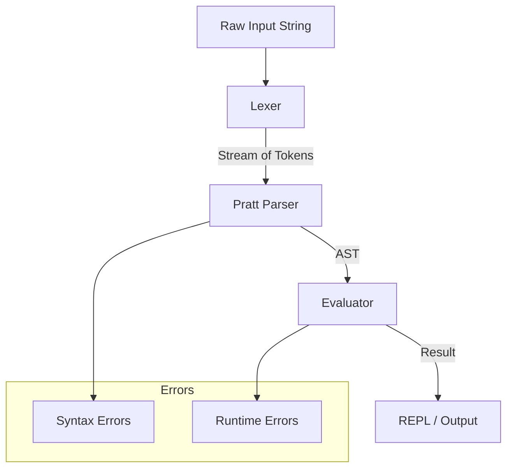

# Parser-Rust

### A From-Scratch Pratt Parser and Expression Evaluator in Rust

This project is a deep dive into building a parser, interpreter, and REPL system entirely from scratch in Rust.
It does not rely on parser generators like ANTLR, LALRPOP, or pest. Instead, it demonstrates how parsing, abstract syntax trees, and evaluation are constructed at a fundamental level.

The goal was to:

* **Understand parsing theory at the implementation level.**
* **Tackle real-world Rust challenges** (borrowing, lifetimes, ownership).
* **Design for correctness and extensibility.**
* **Create a working REPL and test suite** that models the foundation of a simple language.

---

##  Vision

Every major language runtime (JavaScript, Python, Rust itself) has **parsing and evaluation layers** at its core. By implementing a miniature version, we:

* **Demystify language internals.**
* **Learn compiler construction by doing.**
* **Build reusable components** for bigger future projects like DSLs, interpreters, or even compilers.

This project is not just an academic exercise, it’s an **engineering playground** that demonstrates mastery over low-level details that drive language design.

---

##  Features Overview

✔️ **Lexical Analysis (Lexer)**

* Converts raw source text into a stream of tokens (numbers, identifiers, operators, parentheses).
* Span tracking (line, column) for precise error reporting.

✔️ **Pratt Parser (Recursive Parsing)**

* Handles precedence and associativity of operators.
* Supports right-associative exponentiation (`^`).
* Builds an **AST (Abstract Syntax Tree)** for further evaluation.

✔️ **Evaluation Engine**

* Walks the AST and computes results.
* Supports:

  * Arithmetic (`+`, `-`, `*`, `/`, `%`, `^`)
  * Variables (`let x = 10`)
  * Assignments (`x = x + 5`)
  * Built-ins (`sin`, `cos`, `sqrt`, `pow`)

✔️ **Error Handling**

* Structured `EvalError` with spans.
* Handles:

  * Division by zero
  * Unknown identifiers
  * Wrong function arity
  * Syntax errors

✔️ **Interactive REPL**

* Fully functional REPL for experimentation.
* Gracefully handles quitting (`quit`) and blank lines.

✔️ **Testing Suite**

* Unit tests for:

  * Operator precedence
  * Associativity rules
  * Variable handling
  * Error cases

---

## 🏗️ System Architecture

Here’s the **big-picture architecture** of the parser:



### Components

#### 1. **Lexer**

* Splits input into tokens.
* Produces spans for each token.
* Example:
  Input: `2 + 3 * 4`
  Tokens: `[Number(2), Plus, Number(3), Star, Number(4)]`

#### 2. **Pratt Parser**

* Pratt parsing = precedence climbing with binding power.
* Rules:

  * Higher binding power binds tighter.
  * Right-associativity (like `^`) requires careful recursive design.
* Example:
  Input: `2 ^ 3 ^ 2`
  AST: `Pow(2, Pow(3, 2))`

#### 3. **Evaluator**

* Walks the AST.
* Maintains environment for variables.
* Evaluates recursively.
* Example:
  AST: `Assign(x, Mul(10, 2))`
  Result: `x = 20`

#### 4. **Error System**

* Errors carry **span info** to point to exact source location.
* Types:

  * `SyntaxError("expected R_CURLY", Span)`
  * `EvalError::DivByZero(Span)`
  * `EvalError::NameError(name, Span)`

#### 5. **REPL**

* Simple interactive loop.
* Input → Parse → Evaluate → Print.
* Supports quitting with `quit`.

---
## Example Output
 

 

gif
---
## 🧠 Challenges & Solutions

| **Challenge**                    | **What Went Wrong**                                     | **Solution**                                                                |
| -------------------------------- | ------------------------------------------------------- | --------------------------------------------------------------------------- |
| **Exponentiation associativity** | Parsed left-to-right instead of right-to-left.          | Adjusted Pratt parser binding power to `prec - 1`.                          |
| **Borrow checker conflicts**     | Immutable + mutable borrow of `self.env` in evaluation. | Separated `env.get()` (lookup) from mutation, restructured evaluation loop. |
| **Span tracking complexity**     | Some spans unused → warnings.                           | Prefixed unused spans with `_span` when necessary.                          |
| **Division by zero**             | Panicked during eval.                                   | Introduced explicit `EvalError::DivByZero`.                                 |
| **REPL ergonomics**              | Needed graceful exit.                                   | Added `quit` and blank-line handling.                                       |
| **Testing correctness**          | Subtle associativity bugs failing tests.                | Strengthened precedence test suite (`2 ^ 3 ^ 2 == 512`).                    |

---

## 📚 Lessons Learned

1. **Parsing Theory Made Practical**

   * Pratt parsing is elegant for operator precedence grammars.
   * Left vs. right associativity is subtle but critical.

2. **Rust Ownership & Borrowing**

   * Designing around Rust’s strict borrowing rules made the evaluator safer.
   * Learned to restructure state management instead of fighting the compiler.

3. **Span-Driven Error Reporting**

   * Attaching spans to AST nodes makes for professional, compiler-grade error messages.

4. **Test-Driven Development**

   * Tests for associativity and precedence caught real-world bugs.
   * Prevented regressions during refactors.

---

## 📈 Roadmap

* [x] Lexer + Parser
* [x] Pratt parser with precedence/associativity
* [x] AST construction
* [x] Evaluator with environment
* [x] Built-in functions
* [x] Span-based error reporting
* [x] REPL
* [x] Unit tests for arithmetic, vars, errors
* [ ] User-defined functions
* [ ] Conditionals + Boolean logic
* [ ] Strings and concatenation
* [ ] Pattern-matching error reporting
* [ ] Performance optimizations (arena-allocated AST, memoization)
* [ ] Bytecode compiler backend

---

## 🧪 Example Session

```bash
$ cargo run --release
```

```
Extended expression language REPL. Type 'quit' or empty line to exit.
Supports: numbers, + - * / % ^, parentheses, let, assignments, builtins (sin, cos, sqrt, pow, ...)

> 2 + 3 * 4
14

> 2 ^ 3 ^ 2
512

> let x = 10
10

> x = x * 5
50

> sqrt(x) + cos(0)
8

> quit # for quit the REPL
```

---

## Testing

```bash
cargo test
```

```
running 5 tests
test tests::test_variables ... ok
test tests::test_div_by_zero ... ok
test tests::test_unary_and_calls ... ok
test tests::test_basic_arithmetic ... ok
test tests::test_precedence_pow_right_assoc ... ok

test result: ok. 5 passed; 0 failed
```

---

## Why This Project Matters

This project demonstrates the ability to:

* **Design clean system architecture.**
* **Solve deep technical problems** (borrow checker, precedence bugs).
* **Communicate complex systems** via diagrams and documentation.
* **Build production-grade tooling** (tests, error spans, REPL).

This is more than a parser ---> it’s a **microcosm of compiler engineering**.

---
QUOTE:
```
 I strongly believe in "Fuck around and Find out"
```
